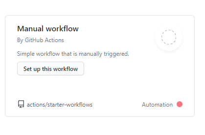
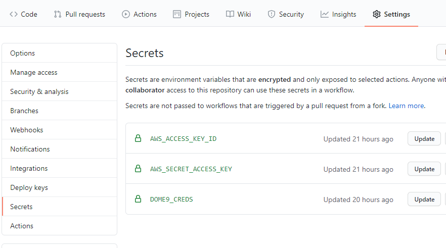
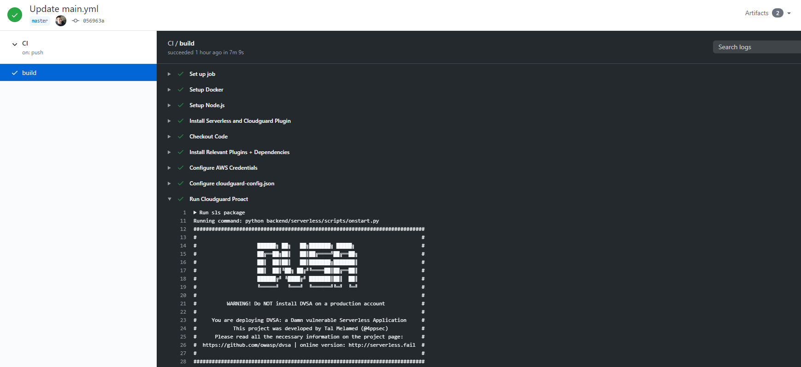

# Cloudguard Workload & Github Actions
Written by Michael Braun

<p align="center">
    
</p>    

The document outlines the process on how to integrate Check Point Cloudguard Workload into the Github Actions CI tool. I'm using the [OWASP Damn Vulnerable Serverless application](https://github.com/OWASP/DVSA).


This first release focuses on the Proact module. Please review the [Check Point Cloudguard Documentation](https://sc1.checkpoint.com/documents/CloudGuard_Dome9/Documentation/Serverless/Serverless.htm?tocpath=Serverless%7C_____0)

## Prerequisites
[Github Account](https://github.com) <br>
[AWS Account](https://aws.amazon.com) with API keys <br>
[Check Point Cloud Security Posture Management Account](https://dome9.com/) with API keys<bt>

Ensure that you have onboarded the AWS account and enabled the Serverless protection in Dome9. In its current form, the steps outlined in this document do not run anything on AWS. However, you need everything set up for the process to complete.

## Setup the Environment
Fork the [DVSA](https://github.com/OWASP/DVSA) repository into your personal Github account. 

Look at the https://github.com/metalstormbass/DVSA/blame/master/backend/src/functions/processing/sls.yml file. <br>

Correct the following values:<br>
FeedbackBucket<br>
ReceiptBucket<br>

These need to be changed to: <br>
feedbackbucket<br>
receiptbucket<br>

<b> Failure to do so will cause and error</b>    

### Create a Github Action


Select manual workflow



The following folder will be automatically created in the repository:

/.github/workflows/

This is where we will define the build and testing procedure for our code. All Github Actions will attempt to execute all YML files stored here.
 
## Prep environment for CI Actions to run
First we need to tell the serverless app to include the Cloudguard plugin. 

Examine the the [serverless.yml](../serverless.yml)

'''bash
plugins:
  - serverless-finch
  - serverless-offline
  - serverless-stack-output
  - serverless-scriptable-plugin
  - serverless-cloudguard-plugin

custom:
  stage: ${opt:stage, self:provider.stage}
  accountId: ${file(backend/serverless/scripts/vars.js):accountId}
  cloudguard:
    fsp:
      Enabled: false
    proact:
      Enabled: true
      StoreJobReport: true
'''

First, notice the plugins installed. We will need to reference this later when defining the dependencies in our CI instructions.

Modify the file and add this line to include the Cloudguard plugin:
```bash
- serverless-cloudguard-plugin
```

Then add the additional parameters for the Cloudguard plugin :

```bash
  cloudguard:
    fsp:
      Enabled: false
    proact:
      Enabled: true
      StoreJobReport: true
```

## Define the Instructions for CI Testing

Please refer to  [main.yml](../.github/actions/main.yml)

First, we need to define the parameters for the runs.
```bash
name: CI

on:
  push:
    branches: [ master ]
  pull_request:
    branches: [ master ]
```

Then we will define our testing environment. For Cloudguard Proact to run, it requires Docker and Node.js. You can see whe have provisioned that below:

```bash
jobs:
  build: 
    runs-on: ubuntu-latest
    env:
      working-directory: . 
    
    steps:
    - name: Setup Docker
      uses: docker-practice/actions-setup-docker@0.0.1
     
    - name: "Setup Node.js"
      uses: actions/setup-node@v1
      with:
        node-version: 12.x
```        

From here, we will then add the serverless environment and download the Cloudguard Plugin.

```bash
 - name: Install Serverless and Cloudguard Plugin
      run: |
          npm install -g serverless 
          npm install -D https://artifactory.app.protego.io/cloudguard-serverless-plugin.tgz
```

Once the environment has been prepped. The code in question must be checked out for testing and the dependencies have to be installed. These dependencies are defined in [serverless.yml](/../serverless.yml).

```bash
 - name: Checkout Code
      uses: actions/checkout@v1
    - name: Install Relevant Plugins + Dependencies
      run: |
          npm install --save serverless-finch
          npm install serverless-offline --save-dev
          npm install --save serverless-stack-output
          npm install --save serverless-scriptable-plugin
          npm install --save serverless-cloudguard-plugin
          pip install requests
```

Now populate the Cloudguard and AWS Secrets. This is located undert Settings>Secrets



<b>Note, the Cloudguard credentials MUST be populated in this format: ACCESS_KEY:SECRET</b>

The following lines login to AWS and define the Cloudguard credentials into a file called cloudguard-config.json

```bash
  - name: Configure AWS Credentials
      uses: aws-actions/configure-aws-credentials@v1
      with:
        aws-access-key-id: ${{ secrets.AWS_ACCESS_KEY_ID }}
        aws-secret-access-key: ${{ secrets.AWS_SECRET_ACCESS_KEY }}
        aws-region: us-east-2  
     
    - name : Configure cloudguard-config.json
      shell: bash
      env:
         SUPER_SECRET: ${{ secrets.DOME9_CREDS }}
      run: |
         echo "$SUPER_SECRET"
         touch cloudguard-config.json
         cat <<EOT >> ./cloudguard-config.json
         {
         "cloudguardAccessToken": "$SUPER_SECRET"
         }
         EOT
```

Then, the Cloudguard process is run againts the code. In order for this to work correctly, you have to ensure that you are running the sls package command in the same directory as the serverless.yml file.

```bash
  - name: Run Cloudguard Proact 
      run: |
          sls package
      working-directory: ${{env.working-directory}}
```

Finally, we need to upload the output files for examination.

```bash
  - name: Upload yml output
      uses: actions/upload-artifact@v2
      with:
        name: cloudguard_output.yml
        path: ./cloudguard_output/CloudGuardScanResults.yaml
   
    - name: Upload html output
      uses: actions/upload-artifact@v2
      with:
       name: cloudguard_output.html
       path: ./cloudguard_output/CloudGuardScanReport.html
```

Commit the changes and the CI action will run. Click on the Actions tab to view the results. 

Here is what a successful run will look like:



You can download the output files from the Artifacts section.
